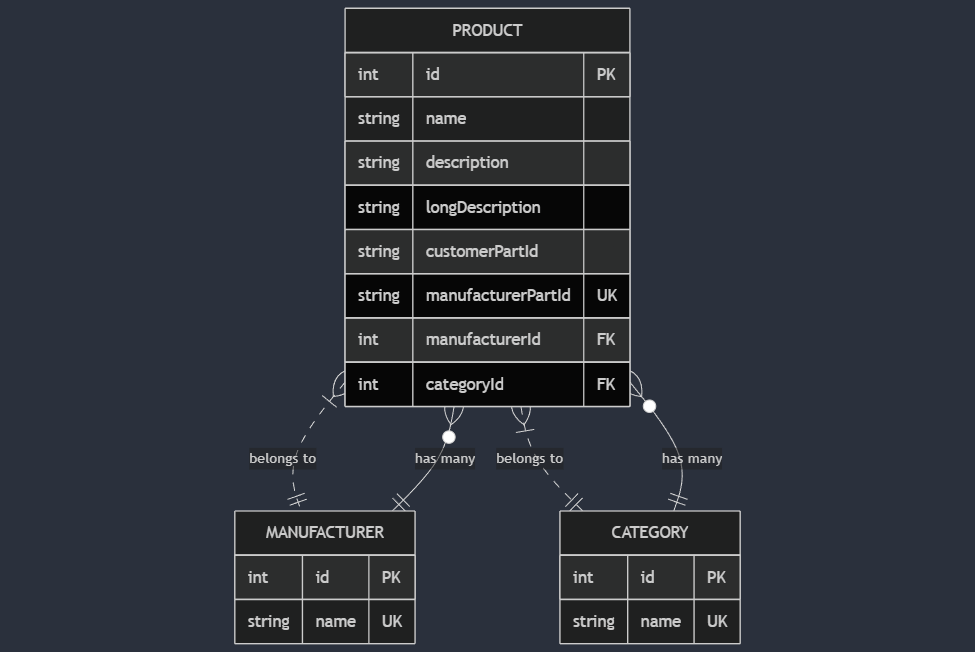

<p align="center">
  <a href="http://nestjs.com/" target="blank"></a>
</p>

[circleci-image]: https://img.shields.io/circleci/build/github/nestjs/nest/master?token=abc123def456
[circleci-url]: https://circleci.com/gh/nestjs/nest

## ERM



## Description

This project is a backend application built with NestJS, utilizing PostgreSQL as the database and GraphQL for queries. The primary use case of this application is to upload a CSV file, which registers and loads all values into the database, including Products, Categories, and Manufacturers. Once the data is successfully imported, users can query the stored values using GraphQL.

## Architecture

- The application follows a modular architecture, leveraging TypeORM for database interactions. Key components include:

- NestJS: Backend framework used for structuring the application.

- PostgreSQL: Relational database used to store product, category, and manufacturer information.

- GraphQL: Query language used for fetching and managing data efficiently.

- TypeORM: ORM for handling database operations.

- CSV Parsing: Functionality to process and extract data from uploaded CSV files.


## Installation

```bash
$ npm install
```

## Running the app

```bash
# development
$ npm run start

# watch mode
$ npm run start:dev

# production mode
$ npm run start:prod
```